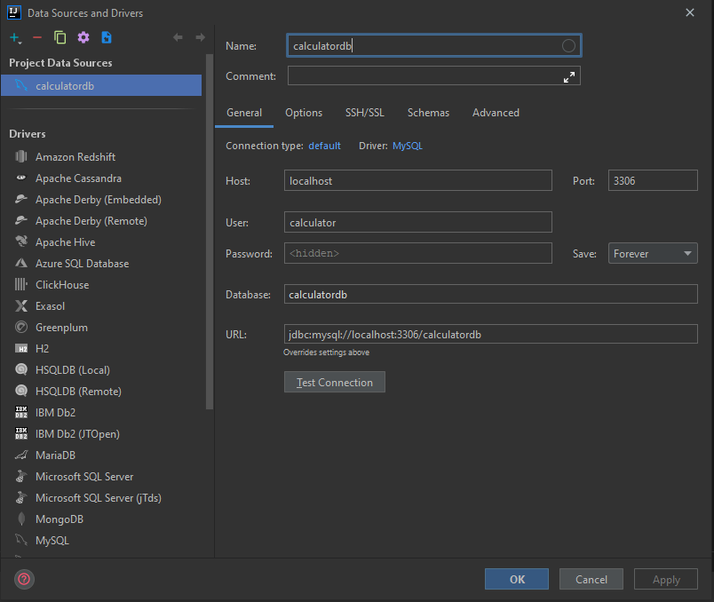

# Calculator back-end

## MySQL database setup
- install mysql and open terminal
- `mysql -u root -p` (and enter the root password)
- `create database calculatordb;` --> Creates the new database
- `create user 'calculator'@'%' identified by 'password';` --> Creates the user
- `grant all on calculatordb.* to 'calculator'@'%';` --> Gives all privileges to the new user on the newly created database

Finally, add the Database to intellij configuration:

 

Tip: if you never used Mysql there may be a warning to install missing drivers, just install them, test connection and you'll be fine.

